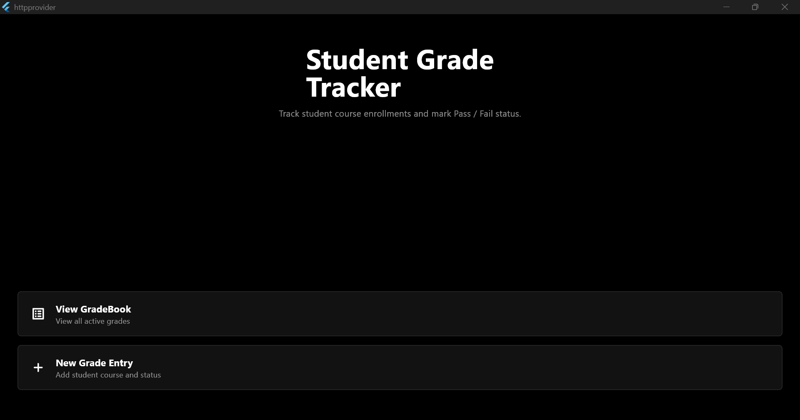
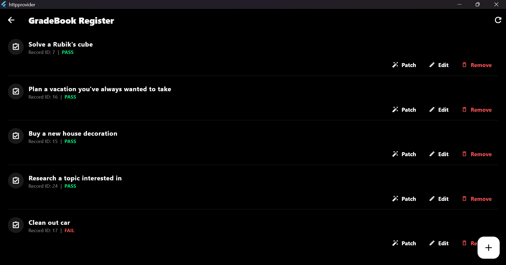
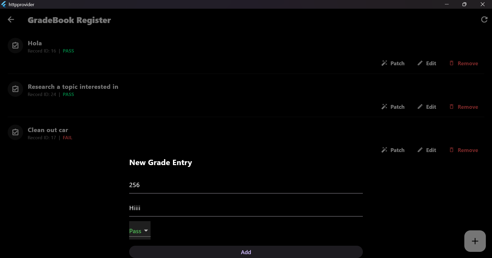
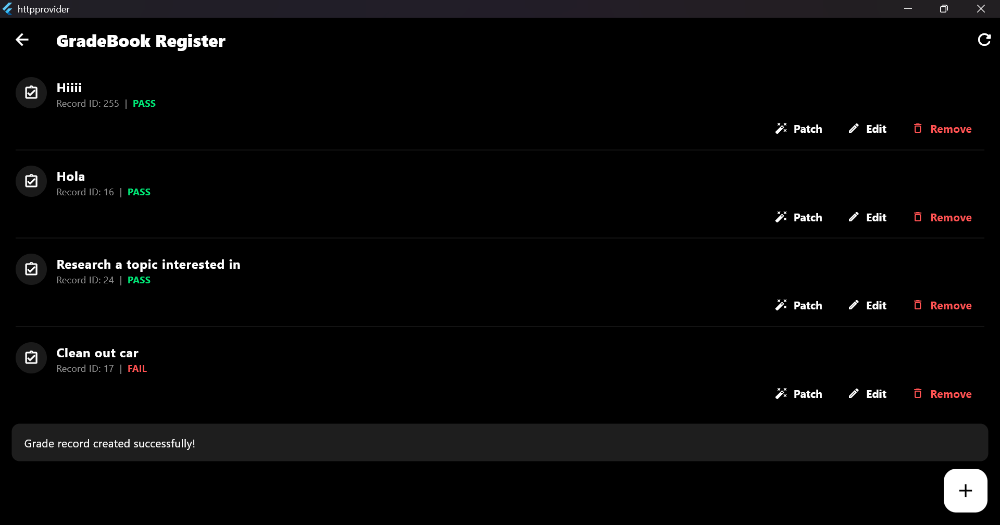
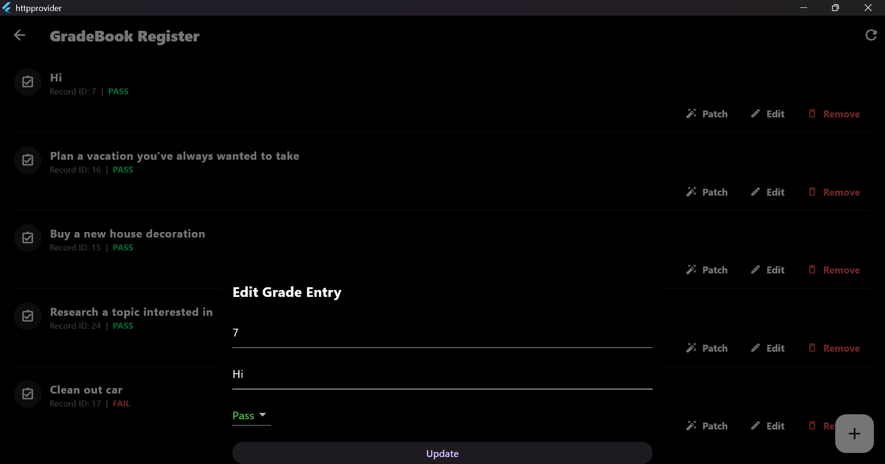
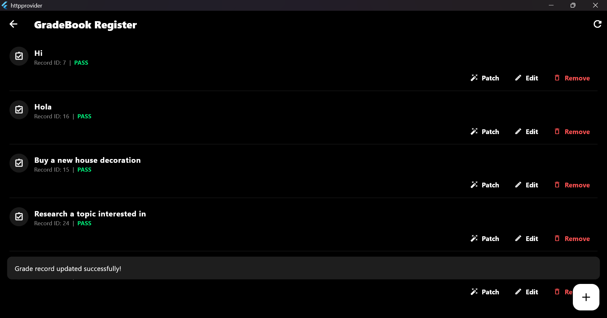
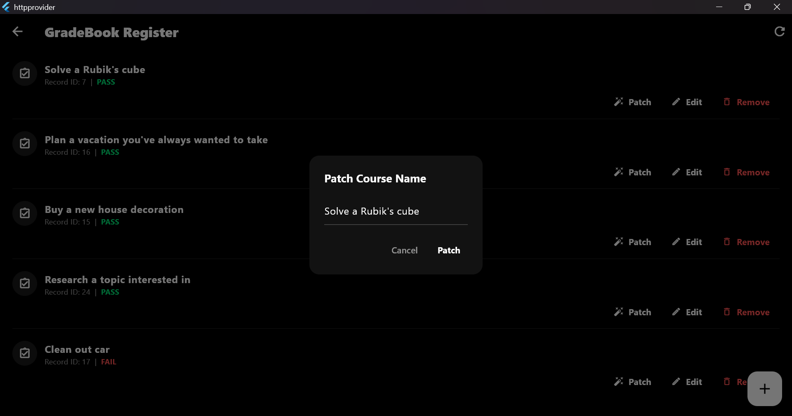
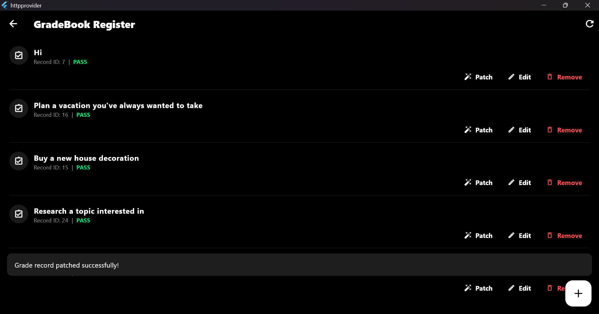
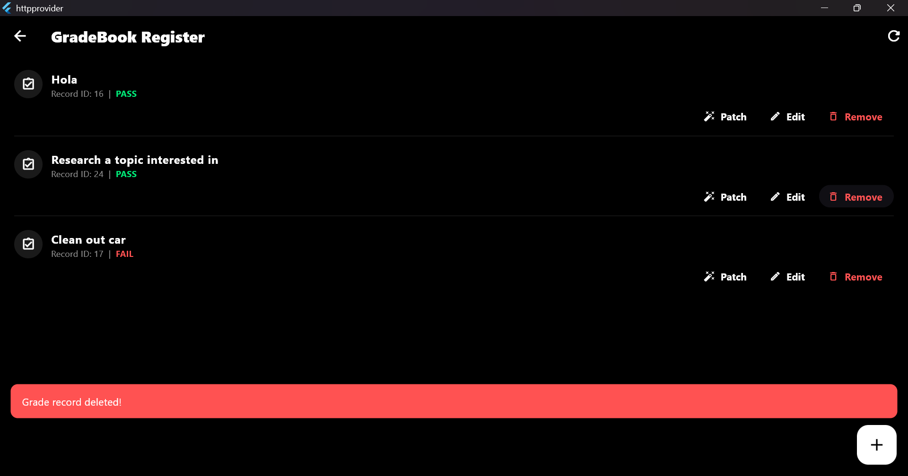
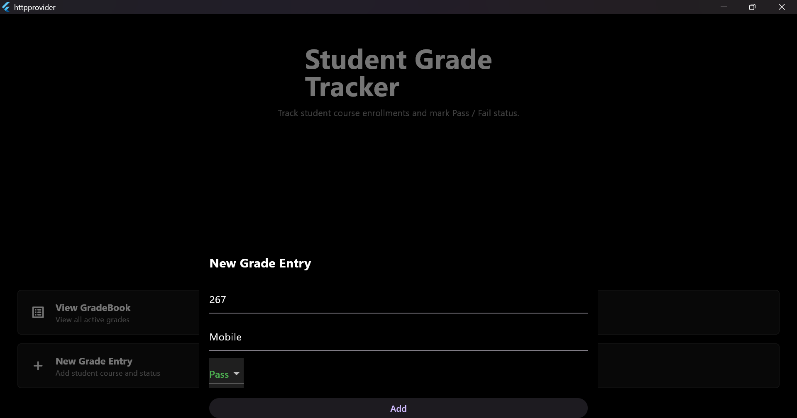

| Name | ID | Section |
| :--- | :--- | :--- |
| Manuhe Habtamu Mekonnen | UGR/2808/16 | 2 |

# Student Register System (HTTP & Provider)

A clean, premium Flutter application to track student course registry and grade status using **Provider** and standard **HTTP** networking.

## How it's Built (Simply Put)
- **State Management**: Built on standard `ChangeNotifier` (`GradeProvider`) to keep UI in sync reactively.
- **Networking**: Calls standard HTTP endpoints (`GET`, `POST`, `PUT`, `DELETE`) pointing to `dummyjson.com/todos` to simulate real-world CRUD requests.
- **Data Flow**: The UI communicates strictly with the `GradeProvider`, which fetches, inserts, updates, and removes student records via a centralized `ApiService`.

## App Screenshots

| Home Page | Student Registration |
| :---: | :---: |
|    Main dashboard showing student list |    Form to add new student records |

| POST Request | POST Success |
| :---: | :---: |
|    Interface for creating entries |    Confirmation of successful creation |

| PUT Request | PUT Success |
| :---: | :---: |
|    Interface for updating entries |    Confirmation of successful update |

| PATCH Request | PATCH Success |
| :---: | :---: |
|    Interface for partial updates |    Confirmation of successful patch |

| DELETE Request | POST by ID |
| :---: | :---: |
|    Confirmation of record deletion |    Fetching/Posting specific records by ID |

